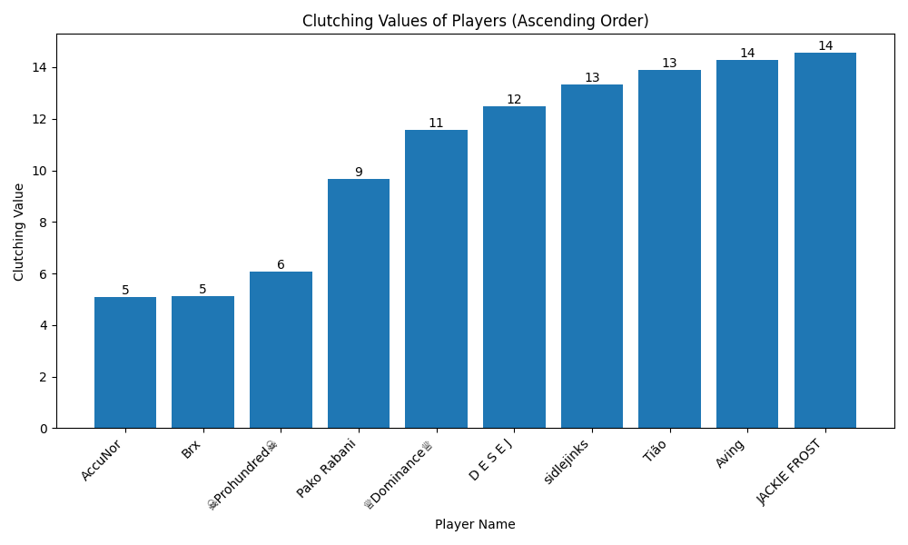
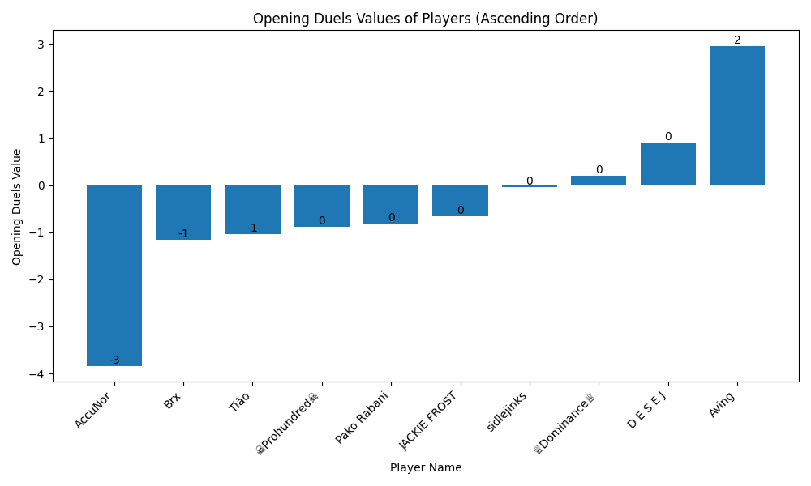
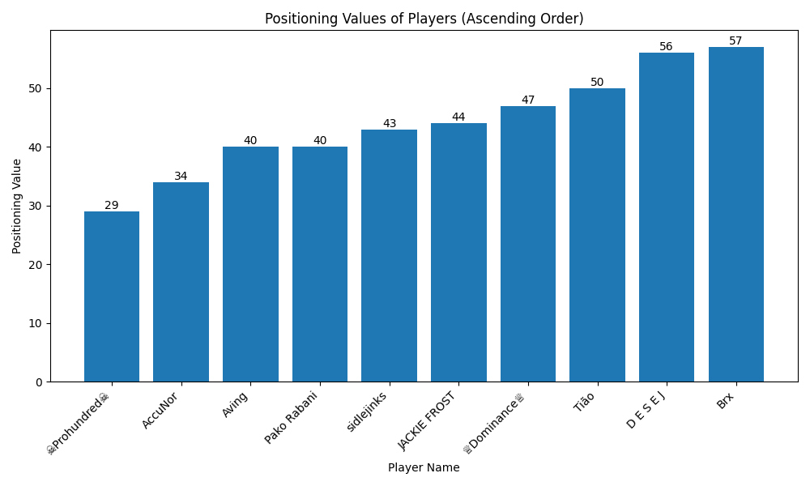

# CSGO-Player-Stats-Scraper

This repository contains a script to scrape player statistics from Leetify and generate a comprehensive HTML report. The script retrieves data such as player names, rankings, ratings, and various performance metrics, and creates an HTML report with player profile images and visual charts of their performance.

## Note

**This script is intended for CS:GO and will not work with CS2** since Valve has removed the `status` command in CS2, which is required for this script to function. <br>As a result, the script will only work with CS:GO profiles.

## Features

- Scrapes player statistics using Selenium
- Extracts detailed player data from a provided text file
- Downloads player profile images
- Generates an HTML report with player data and performance charts
- Visualizes player performance metrics using matplotlib

## Requirements

- Python 3.x
- Selenium
- webdriver-manager
- requests
- matplotlib

## Setup

1. Clone the repository:

    ```bash
    git clone https://github.com/CliveMlt/player-stats-scraper.git
    cd CSGO-Player-Stats-Scraper
    ```

2. Install the required packages:

    ```bash
    pip install -r requirements.txt
    ```

3. Ensure you have `chromedriver` installed. You can manage this automatically with `webdriver-manager`.

## Usage

1. Place the `command_output.txt` file in the root directory. This file should contain the raw player data to be processed that is outputted using the status command in CSGO like the example below:
    ```ruby
    Connected to =[A:1:2865787925:24098]:0
    hostname: Valve CS:GO EU West Server (srcds405-fra2.274.121)
    version : 1.38.7.9 secure
    os      :  Linux
    type    :  official dedicated
    map     : de_mirage
    players : 10 humans, 0 bots (10/10 max) (not hibernating)
    
    # userid name uniqueid connected ping loss state rate
    #  3 2 "Wodzu" STEAM_1:0:156007386 01:09 50 0 active 196608
    #  4 3 "Johnson" STEAM_1:0:136787950 01:09 48 0 active 196608
    #  7 6 "Idk_Goga" STEAM_1:0:567440028 01:09 54 0 active 786432
    #  8 7 "♕Dominance♕" STEAM_1:0:71724654 01:09 92 0 active 786432
    #  9 8 "я бог со мной русский" STEAM_1:1:185366920 01:09 89 0 active 786432
    # 10 9 "RoGi2k💕" STEAM_1:1:149258380 01:09 91 0 active 196608
    # 11 10 "otricayou" STEAM_1:1:461303453 01:08 90 0 active 196608
    # 12 11 "Jeffrey Dahmer" STEAM_1:1:31040205 01:08 123 0 active 786432
    # 13 12 "Unique" STEAM_1:0:45500711 01:08 95 0 active 786432
    # 14 13 "☠Prohundred☠" STEAM_1:1:23643840 01:07 66 0 active 786432
    #end
    ```


2. Run the script:

    ```bash
    python csgo_scraper.py
    ```

The script will create a folder with the current date and time, process the player data, download profile images, generate performance charts, and create an HTML report in the folder.

## Output

The script generates the following files in a timestamped folder:

- `player_info.txt`: Text file containing detailed player information.
- `player_data.csv`: CSV file with structured player data.
- `report.html`: HTML report with player profiles, images, and performance metrics.
- `aim_values_graph.png`, `utility_graph.png`, `positioning_graph.png`, `opening_duels_graph.png`, `clutching_graph.png`: Performance charts for various metrics.

## Example Outputs

1. HTML report:


2. Player Info:
    ```bash
    Name: Tião
    Current Rank: Master Guardian 2
    Highest Rank: Distinguished Master Guardian
    Win Rate: 52%
    Leetify Rating: +2.62
    T Rating: +1.48
    CT Rating: +3.63
    Aim: 57
    Utility: 65
    Positioning: 50
    Opening Duels: -1.04
    Clutching: +13.88
    ```
    
3. Player Data:
    
|Name        |Current Rank         |Highest Rank                 |Win Rate|Leetify Rating|T Rating|CT Rating|Aim|Utility|Positioning|Opening Duels|Clutching|                |
|------------|---------------------|-----------------------------|--------|--------------|--------|---------|---|-------|-----------|-------------|---------|----------------|
|Tião        |Master Guardian 2    |Distinguished Master Guardian|52%     |+2.62         |+1.48   |+3.63    |57 |65     |50         |-1.04        |+13.88   |Tião.jpg        |
|sidlejinks  |Master Guardian 1    |Master Guardian 2            |43%     |0.00          |-0.26   |+0.27    |57 |63     |43         |-0.05        |+13.32   |sidlejinks.jpg  |
|D E S E J   |Master Guardian 2    |Distinguished Master Guardian|55%     |+0.45         |+2.62   |-1.45    |65 |65     |56         |+0.91        |+12.49   |D_E_S_E_J.jpg   |
|☠Prohundred☠|Master Guardian 1    |Master Guardian Elite        |50%     |-0.63         |-0.42   |-0.86    |67 |60     |29         |-0.89        |+6.08    |☠Prohundred☠.jpg|
|Pako Rabani |Gold Nova Master     |Distinguished Master Guardian|36%     |-0.02         |-0.65   |+0.76    |78 |61     |40         |-0.82        |+9.68    |Pako_Rabani.jpg |
|AccuNor     |Master Guardian 2    |Legendary Eagle              |29%     |-4.98         |-4.85   |-5.09    |11 |44     |34         |-3.84        |+5.08    |AccuNor.jpg     |
|Aving       |Master Guardian 2    |Supreme Master First Class   |81%     |+7.18         |+9.40   |+5.07    |83 |40     |40         |+2.95        |+14.28   |Aving.jpg       |
|JACKIE FROST|Master Guardian Elite|Legendary Eagle              |52%     |+1.72         |+4.34   |-0.91    |66 |69     |44         |-0.66        |+14.56   |JACKIE_FROST.jpg|
|Brx         |Master Guardian 2    |Distinguished Master Guardian|57%     |-2.10         |-0.28   |-3.75    |63 |57     |57         |-1.16        |+5.13    |Brx.jpg         |
|♕Dominance♕ |Master Guardian 2    |Master Guardian Elite        |52%     |+0.21         |-0.29   |+0.75    |59 |62     |47         |+0.19        |+11.56   |♕Dominance♕.jpg |
    
4. Aim Values report:


5. Clutching Graph:


6. Opening Duels Graph:


7. Positioning Graph:


7. Utility Graph:


## Troubleshooting

- Ensure `chromedriver` is correctly installed and the path is properly set.
- If the script encounters any errors, check the console output for detailed error messages.

## License

This project is licensed under the MIT License. See the [LICENSE](LICENSE) file for details.

---
